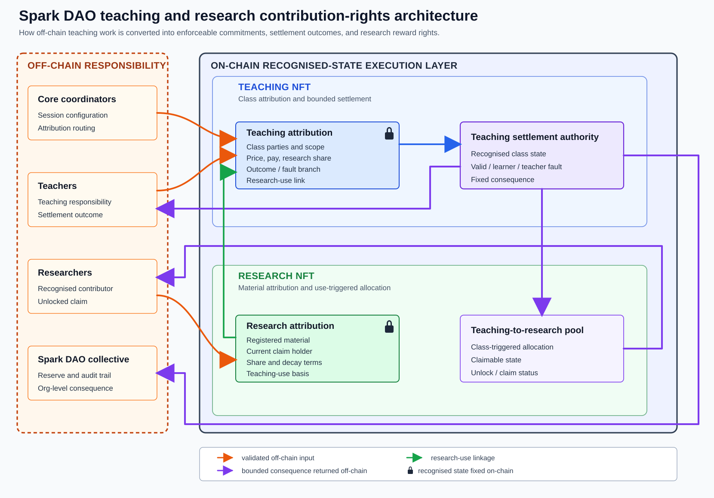

# Spark DAO on Base

Base/Solidity implementation of the Spark DAO protocol.

This repository contains the EVM contracts, Foundry tests, deployment scripts,
lightweight client helpers, and generated calibration outputs used by the Base
implementation.

## What It Contains

- Research assets and contribution-right positions
- Teaching settlement with per-seat accounting
- Claim-pull research rewards
- Multi-stable reserve accounting
- Local demo and deployment scripts
- Reproducible gas and cost outputs

## Module Map



The figure is conceptual. Contract interfaces, storage, and deployment wiring are defined
by the Solidity sources.

Core contracts:

- `ResearchRegistry`: research assets, positions, direct revenue, buybacks, reward-claim
  accounting, and research-side reserves.
- `TeachingRegistry`: teaching sessions with `classSize`, per-seat payment, refund,
  customer fault, session-level teacher fault, and reward callback. A single-learner
  lesson uses one seat.
- `TeachingRewardDistributor`: teaching reward pools and claim-pull distribution.
- `TeachingPricingPolicyV1`: tiered teaching quote module for class sizes `1..100`.
- `TeachingNftToken`: non-transferable teaching token minted for each teaching session.
- `ResearchPositionToken`: non-transferable registry-minted research position token.

## Settlement Surface

Teaching rewards are pull-based. The teaching registry records a settled pool through
the distributor, and the current research-position holder claims later.

Teaching sessions are scheduled by teacher and coordinator confirmation. Valid sessions can
close through coordinator fallback after the timeout, or automatically after `scheduledAt`
when teacher delivery and paid attendance over half of `classSize` are recorded.

On valid close, paid seats that are not marked customer-fault are treated as completed
seats and receive no refund. Customer fault is coordinator-marked while the session is
open and requires a paid seat.

Research claim rights follow current holder state. If a position is bought back by the DAO,
future claims route to the treasury holder.

Stable assets are frozen when protocol objects are created. Reserves are tracked by stable
asset, and authority withdrawals are limited to idle balance.

Teaching pricing uses a power-law capacity multiplier approximated by the tier table
in `TeachingPricingPolicyV1`.

## Commands

```bash
forge build --sizes --skip script
forge test -vv
npm run client:typecheck
npm run check:reproducibility-config
npm run check:teaching-surface
npm run simulate:teaching-cost
npm run check:calibration
```

`npm run check:calibration` regenerates Teaching lifecycle, class-size, and cost
outputs. Generated outputs should not be edited by hand.

## Deployment And Demos

Deployment scripts:

- `DeployTokens.s.sol`
- `DeployRegistry.s.sol`
- `SetTokenMinters.s.sol`

Local demos:

- `DemoResearch.s.sol`
- `DemoTeaching.s.sol`

The registry deployment script wires the teaching stack. Use `classSize = 1`
for a single-learner lesson.

Environment variables are listed in `.env.example`. Runtime wiring can be checked with:

```bash
npm run check:registry-admin-state
npm run check:module-compatibility
```

## Documentation

- `src/README.md`: contract responsibilities and wiring
- `test/README.md`: test coverage and calibration writers
- `script/README.md`: deployment and demo scripts
- `client/README.md`: client helpers and address configuration
- `docs/RUNBOOK.md`: local and deployment workflow
